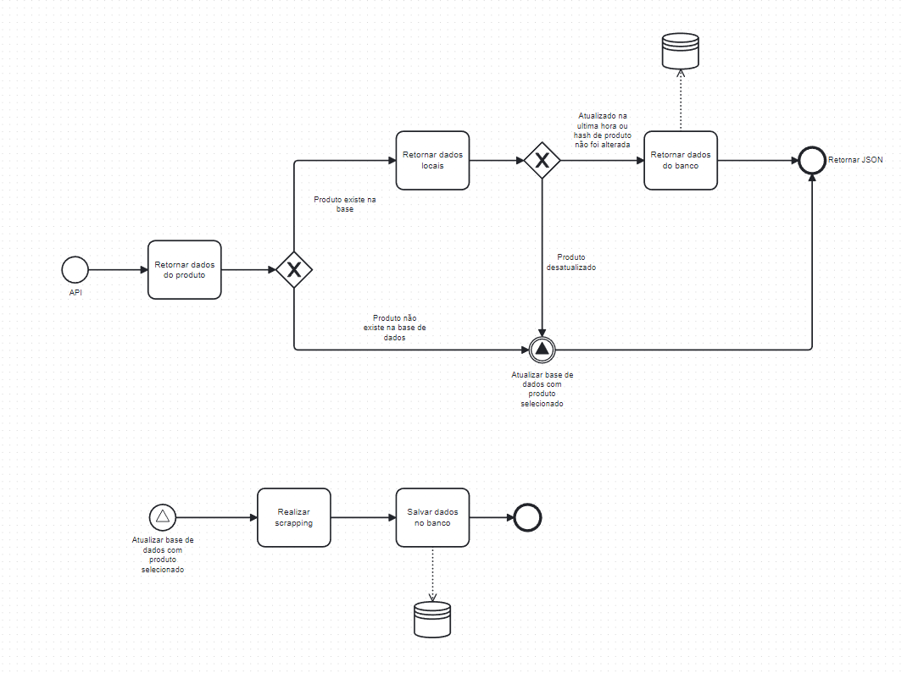

## Decision

There are some concepts that, for a challenge, we can't approach, because we're talking about a challenge and not a real project. 

In a large company as Pelando, that every day scrap thousands of websites, we have to discuss deeper how to choose the architecture.

This is my data flow I decided to go through, to simplify my life at coding this challenge.

## Dreaming architecture in my humble opinion

 To turn my decision in a more scalable, we can use queues as RabbitMQ or Kafka for example, to  have the guarantee that all my requests will be executed and stored in the database, avoid doing a request all the way as the diagram above.

We must use a proxy server to not block our IP requests and use a captcha solver service when websites understand we're using our spiders to get their information.

We can decide to use monitoring service to detect when a structure changes and then turn off using feature toggles crawlers as [Unleash](https://www.getunleash.io/) service for example to not overcharge resources.

Furthermore, we have lots of technical decisions to go through, that was the points I chose to talk about because in a challenge we can't go deep.
